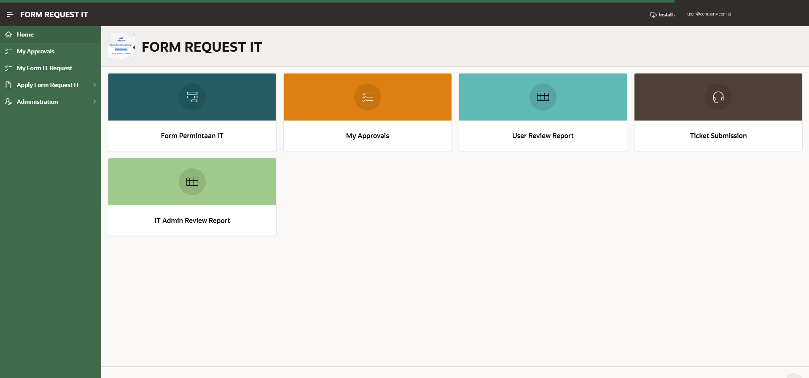

# FRITS — Form Request IT System

An Oracle APEX application that digitizes a company's paper-based **IT request form**, turning it into a mobile-installable, end-to-end approval workflow that automatically raises a helpdesk ticket once approved.



> Screenshot: application home page (Redwood theme) showing the main modules available to end users.

---

## Overview

Before FRITS, IT requests (hardware purchase, new employee equipment, application access, etc.) were submitted on a printed form, physically signed by a manager/director, and attached to a helpdesk ticket by hand. FRITS replaces that entire paper trail with a single Oracle APEX app that:

1. Captures the request digitally (equivalent fields to the original hardcopy form)
2. Routes it through a configurable, multi-level approval chain
3. Notifies approvers by **email and web push notification**
4. Lets approvers act directly from the **email button** or from the **in-app approval inbox**
5. Automatically creates a ticket in the helpdesk system once approved, and notifies the requester and the assigned IT staff
6. Lets the requester track the status of their request at any time

## Key Features

- **Approval Workflow engine** — built on Oracle APEX's native Workflow/Task feature, with dedicated task definitions for the request and its downstream transaction.
- **Progressive Web App (PWA)** — installable on desktop and mobile ("Add to Home Screen"), works and feels like a native app.
- **Web Push Notifications** — approvers are notified instantly when a new task is waiting for them, even when the app isn't open.
- **Email-based approvals** — approve/reject directly from the notification email, no login required for that action.
- **Automatic ticket generation** — approved requests are pushed into the helpdesk ticketing system and auto-assigned to IT staff.
- **Document generation** — review/summary reports are generated as Word documents via a print/report plugin, for offline recordkeeping and audit trail.
- **Role-based access** — separate experiences for Requester, Approver, IT Admin, and Application Administrator.
- **Built-in reporting** — request status reports for end users, an admin-facing review report, and the standard APEX Activity Dashboard (top users, error log, page performance, page views).

## Application Modules

| Module | Description |
|---|---|
| Home | Landing dashboard with quick links to all modules |
| Apply Form Request IT | Digital version of the original IT request form |
| My Form IT Request | Requester's view of their submitted requests and current status |
| My Approvals | Approver's task inbox for pending requests |
| Ticket Submission | Shortcut to raise a general IT helpdesk ticket |
| User Review Report | Reporting view for requesters |
| IT Admin Review Report | Reporting view for IT administrators |
| Administration | Access control, configuration, activity dashboard, feedback |

## Approval Flow (High Level)

```
Requester fills the digital form
        │
        ▼
Approver notified (email + push notification)
        │
        ▼
Approver approves/rejects (via email button OR in-app)
        │
        ▼
Ticket auto-created in the helpdesk system
        │
        ▼
Assigned IT staff notified → resolves the request
        │
        ▼
Requester tracks status until closed
```

## Tech Stack

- **Oracle APEX** — Universal/Redwood theme, native Approvals (Workflow) feature, native PWA support (manifest, service worker, VAPID push credentials)
- **Oracle Database** (backing schema/objects for the application)
- **ORDS** — REST/web listener for the APEX engine
- **Plugins used**
  - A print/report plugin (dynamic action + process type) for generating Word document reports from APEX pages
  - A digital signature capture plugin for e-signature support on approval steps

## Repository Contents

| File | Description |
|---|---|
| `f105197.sql` | Full Oracle APEX application export as a single installable SQL script |
| `f105197.zip` | Same application export, split into one file per page/shared component — easier to diff and version-control individual changes |

## Installation

1. In Oracle APEX App Builder, go to **App Builder → Import**, upload `f105197.sql` (or unzip `f105197.zip` and import it as a **split** application via SQLcl), and install it into a workspace of your choice.
2. After install, update the following to match your own environment (these are workspace-specific and will not carry over from the export):
   - Authentication scheme / identity provider
   - Web Push Notification credentials (VAPID keys)
   - Any hard-coded intranet/portal URLs used for session timeout redirects
   - Print/report plugin service endpoint and API key (if used)
3. Re-point the workflow task definitions' notification templates (email sender, links) to your own domain.
4. Demo: https://oracleapex.com/ords/r/kcsi/form-request-it/login

> **Note:** This export originates from a live internal system. Company name, internal URLs, and staff names referenced during development have been generalized/redacted in this README and in the accompanying screenshot before publishing.

## Why This Project Is Here

This repository is part of my **Oracle ACE Apprentice Program — Product Usage Milestone** portfolio, documenting real-world, production use of Oracle APEX features including native Approval Workflows, PWA/offline-capable delivery, Web Push Notifications, and third-party plugin integration for document generation and e-signatures.

## Author

**Iwan Herdian**
Oracle APEX / Oracle EBS practitioner
GitHub: [iwanhe](https://github.com/iwanhe)
